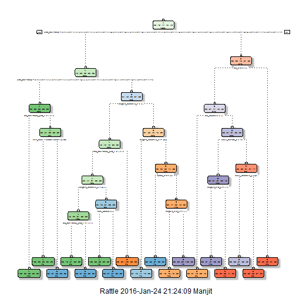
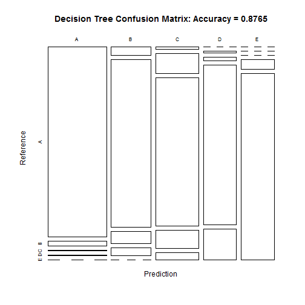
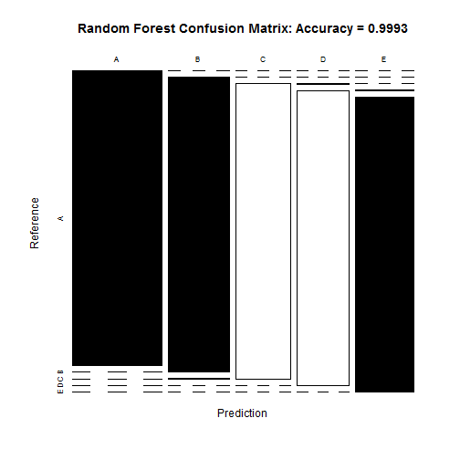

## Report Synopsis

Purpose of this project is to predict the exercise behavior in the 20 test cases.
In this project, two datasets are provided. The large training dataset is partitioned 
to build and test prediction models to predict exercise behavior. Then the model is applied
to the test dataset of 20 cases to predict exercise behavior of them. 
In building the model, "Decision Tree" and "Random Forest" methods were evaluated and 
"Random Forest" method is considered for prediction due to higher accuracy (99.9%). 
Before applying any model, both training and testing datasets are cleaned removing 
near zero  variables, removing columns with significant (>60%) NAs and other redundant columns 
and matching the column classes of both training and testing datasets.

### Project Background
 
Using devices such as Jawbone Up, Nike FuelBand, and Fitbit it is now possible to 
collect a large amount of data about personal activity relatively inexpensively. 
These type of devices are part of the quantified self movement - a group of enthusiasts 
who take measurements about themselves regularly to improve their health, to find 
patterns in their behavior, or because they are tech geeks. One thing that people 
regularly do is quantify how much of a particular activity they do, but they rarely 
quantify how well they do it. In this project, your goal will be to use data from 
accelerometers on the belt, forearm, arm, and dumbell of 6 participants. They were 
asked to perform barbell lifts correctly and incorrectly in 5 different ways. More 
information is available from the website here: http://groupware.les.inf.puc-rio.br/har 
(see the section on the Weight Lifting Exercise Dataset).

### Project goal

The goal of the project is to predict the manner in which they did the exercise. 
This is the "classe" variable in the training set. You may use any of the other variables 
to predict with. You should create a report describing how you built your model, how 
you used cross validation, what you think the expected out of sample error is, and why 
you made the choices you did. You will also use your prediction model to predict 20 
different test cases.
 
### Data
 
The training data for this project are available here:
https://d396qusza40orc.cloudfront.net/predmachlearn/pml-training.csv
 
The test data are available here:
https://d396qusza40orc.cloudfront.net/predmachlearn/pml-testing.csv
 
The data for this project come from this source: http://groupware.les.inf.puc-rio.br/har

### Loading required packages

```r
library(caret)
library(rpart)
library(rpart.plot)
library(randomForest)
library(rattle)
library(RColorBrewer)
library(knitr)
```
Set seed

```r
set.seed(22222)
```
### Data Collection:

```r
url_Training <- "https://d396qusza40orc.cloudfront.net/predmachlearn/pml-training.csv"
url_Testing <- "https://d396qusza40orc.cloudfront.net/predmachlearn/pml-testing.csv"

# Reading the datafiles from web:

# Training <- read.csv(url(url_Training), na.strings = c("NA", "#DIV/0!",""))
# Testing <- read.csv(url(url_Testing), na.strings = c("NA", "#DIV/0!",""))

# Downloading the files to computer and then reading it locally from computer.
# This is the method followed in reading the data multiple times during this project
# as reading from web is much slower using R.

# if (!"pml-training.csv" %in% dir("./")) {
#     download.file(url_Training, destfile = "pml-training.csv")}
# 
# if (!"pml-testing.csv" %in% dir("./")) {
#     download.file(url_Testing, destfile = "pml-testing.csv")}
```


```r
Training <- read.csv("pml-training.csv", header=T, sep=",",
                     na.strings = c("NA", "#DIV/0!",""))
Testing <- read.csv("pml-testing.csv", header=T, sep=",",
                    na.strings = c("NA", "#DIV/0!",""))
```

### Exploring the Training and Testing datasets:

```r
str(Training) # results not shown
```

```r
dim(Training)
```

```
## [1] 19622   160
```

```r
table(Training$classe)
```

```
## 
##    A    B    C    D    E 
## 5580 3797 3422 3216 3607
```


```r
str(Testing)
head(Testing)
dim(Testing)
```
Since the training dataset is large, partition the training dataset into 
two sub datasets: Training_sub & Testing_sub to build Machine Learnning models 
and test them before applying the models on the 20 test cases.

```r
inTrain <- createDataPartition(y=Training$classe, p=0.7, list=FALSE)
Training_sub <- Training[inTrain,]
Testing_sub <- Training[-inTrain,]
```

### Data Cleansing before applying any ML technique
#### A. Cleaning the training dataset

1) Eliminating near zero variables from training dataset (results not shown because lot of line)


```r
NZV_Training_sub <- nearZeroVar(Training_sub, saveMetrics=T)
NZV_Training_sub
Training_sub <- Training_sub[,NZV_Training_sub$nzv==FALSE]
```


```r
dim(Training_sub)
```

```
## [1] 13737   130
```

2) Removing variables with too many NAs and removing repeated columns


```r
Training_2 <- Training_sub

for (i in 1:length(Training_sub)){
    if ( sum(is.na(Training_sub[, i])) / nrow(Training_sub) >= .6){
        for (j in 1:length(Training_2)){
            if(length(grep(names(Training_sub)[i],names(Training_2)[j]))==1){
                Training_2 <- Training_2[,-j]
            }
        }
    }
}
```
Set back to the original variable name

```r
Training_sub <- Training_2
rm(Training_2)   # Remove the temporary dataset from memory
```

3) Remove the first column as it is redundant for ML


```r
Training_sub <- Training_sub[c(-1)]
dim(Training_sub)
```

```
## [1] 13737    58
```
#### B. Cleaning the testing dataset 
Keep the same columns as in the training dataset

```r
clean1 <- colnames(Training_sub)
# clean1
clean2 <- colnames(Training_sub[,-58]) # remove the classe column (to be predicted)
# clean2
Testing_sub <- Testing_sub[clean1] # Testing_sub dataset now has same variable as in training
Testing <- Testing[clean2] # Testing dataset now has same variables as in Training_sub
dim(Training_sub)
```

```
## [1] 13737    58
```

```r
dim(Testing_sub)
```

```
## [1] 5885   58
```

```r
dim(Testing)
```

```
## [1] 20 57
```
Make same datatype for each column in the Testing dataset as in the Training_sub dataset, 
paerticularly important for random forest

```r
for (i in 1:length(Testing)){
    for (j in 1: length(Training_sub)){
        if (length(grep(names(Training_sub[i]), names(Testing)[j]))==1){
            class(Testing[j]) <- class(Training_sub[i])
        }    
    }
}
```
Check that column datatypes of training and testing datasets are matched
by adding (if works) and then removing one row from training with testing 

```r
Testing <- rbind(Training_sub[2,-58], Testing) 
Testing <- Testing[-1,]
dim(Testing)
```

```
## [1] 20 57
```

### Using Machine Learning algorithm: Decision Tree
"classe" variable is considered against all other variable after data cleansing

```r
modFit_tree <- rpart(classe ~., method="class", data=Training_sub)
fancyRpartPlot(modFit_tree) #plot the decision tree
```

 

Predict in-sample error in the Testing_sub dataset


```r
pred_tree <- predict(modFit_tree, Testing_sub, type="class")
```
Check the confusion matrix in decision tree model

```r
CM_tree <- confusionMatrix(pred_tree, Testing_sub$classe)
CM_tree
```

```
## Confusion Matrix and Statistics
## 
##           Reference
## Prediction    A    B    C    D    E
##          A 1609   41    6    2    0
##          B   50  967   68   44    0
##          C   15  124  933  114   44
##          D    0    7   19  757  146
##          E    0    0    0   47  892
## 
## Overall Statistics
##                                           
##                Accuracy : 0.8765          
##                  95% CI : (0.8678, 0.8848)
##     No Information Rate : 0.2845          
##     P-Value [Acc > NIR] : < 2.2e-16       
##                                           
##                   Kappa : 0.8438          
##  Mcnemar's Test P-Value : NA              
## 
## Statistics by Class:
## 
##                      Class: A Class: B Class: C Class: D Class: E
## Sensitivity            0.9612   0.8490   0.9094   0.7853   0.8244
## Specificity            0.9884   0.9659   0.9389   0.9650   0.9902
## Pos Pred Value         0.9704   0.8565   0.7585   0.8149   0.9499
## Neg Pred Value         0.9846   0.9638   0.9800   0.9582   0.9616
## Prevalence             0.2845   0.1935   0.1743   0.1638   0.1839
## Detection Rate         0.2734   0.1643   0.1585   0.1286   0.1516
## Detection Prevalence   0.2817   0.1918   0.2090   0.1579   0.1596
## Balanced Accuracy      0.9748   0.9074   0.9241   0.8752   0.9073
```

Plot Decision Tree confusion matrix

 
### Using Machine Learning algorithm: Random Forest 

```r
modFit_RF <- randomForest(classe~., data=Training_sub)
```
Predict in-sample error in the Testing_sub dataset

```r
pred_RF <- predict(modFit_RF, Testing_sub, type="class")
```
Check the confusion matrix in the Random forest model

```r
CM_RF <- confusionMatrix(pred_RF, Testing_sub$classe)
CM_RF
```

```
## Confusion Matrix and Statistics
## 
##           Reference
## Prediction    A    B    C    D    E
##          A 1674    0    0    0    0
##          B    0 1139    1    0    0
##          C    0    0 1023    0    0
##          D    0    0    2  963    0
##          E    0    0    0    1 1082
## 
## Overall Statistics
##                                           
##                Accuracy : 0.9993          
##                  95% CI : (0.9983, 0.9998)
##     No Information Rate : 0.2845          
##     P-Value [Acc > NIR] : < 2.2e-16       
##                                           
##                   Kappa : 0.9991          
##  Mcnemar's Test P-Value : NA              
## 
## Statistics by Class:
## 
##                      Class: A Class: B Class: C Class: D Class: E
## Sensitivity            1.0000   1.0000   0.9971   0.9990   1.0000
## Specificity            1.0000   0.9998   1.0000   0.9996   0.9998
## Pos Pred Value         1.0000   0.9991   1.0000   0.9979   0.9991
## Neg Pred Value         1.0000   1.0000   0.9994   0.9998   1.0000
## Prevalence             0.2845   0.1935   0.1743   0.1638   0.1839
## Detection Rate         0.2845   0.1935   0.1738   0.1636   0.1839
## Detection Prevalence   0.2845   0.1937   0.1738   0.1640   0.1840
## Balanced Accuracy      1.0000   0.9999   0.9985   0.9993   0.9999
```

Plot random forest confusion matrix

 

### Apply model to the 20 test cases

Based on very high accuracy, random forest model is used to predict 
the exercise behavior of the 20 test cases in the Testing dataset

```r
pred_RF_Testing <- predict(modFit_RF, Testing, type="class")
pred_RF_Testing
```

```
## 22  3  4  5  6  7  8  9 10 11 12 13 14 15 16 17 18 19 20 21 
##  B  A  B  A  A  E  D  B  A  A  B  C  B  A  E  E  A  B  B  B 
## Levels: A B C D E
```
